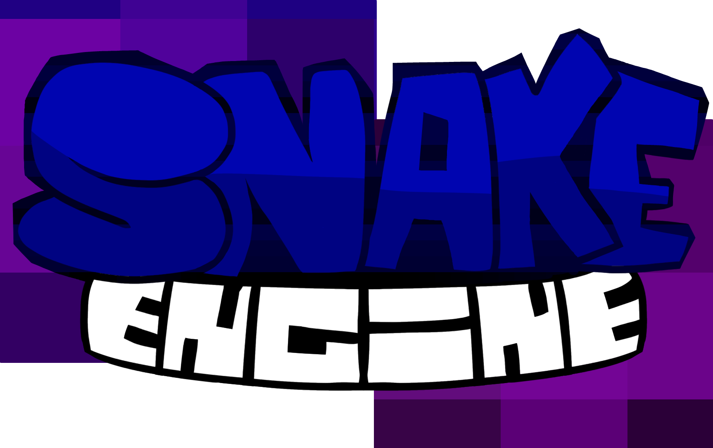
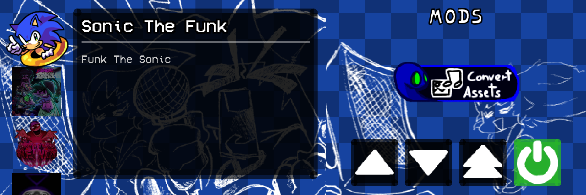
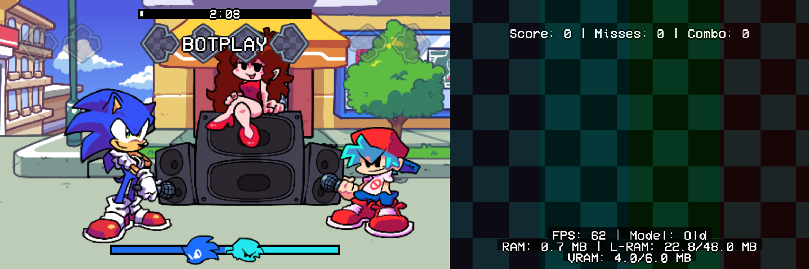
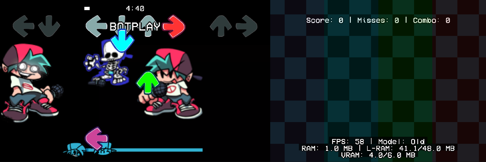

# Snake Engine

A Friday Night Funkin' engine tailored for the **Nintendo 3DS**, built natively in C++ with **devkitARM**, **libctru**, and **citro2d**.

<p align="center">
  
</p>


---

## Psych Engine API Support

Snake Engine includes support for the **Psych Engine Lua API**. This is not a 1:1 implementation and some functions may behave differently or not be available.

<p align="left">
  
</p>
<p align="left">
  
</p>
<p align="left">
  
</p>

---

## ⚠️ Modding on 3DS — Read This First

Even though Snake Engine exposes part of the Psych Engine Lua API, **this is not a PC engine**. The 3DS hardware is significantly more constrained, and mods that work fine on PC may run poorly or crash here. Everything needs to be handled with care.

### 1. Use the right file formats

Avoid heavy formats like `.ogg`, `.png`, or `.mp4`. The 3DS has dedicated hardware for specific formats — use those instead:

| Asset Type | ❌ Avoid | ✅ Use instead | Tool |
|---|---|---|---|
| Audio | `.ogg`, `.wav`, `.mp3` | `.adp` | [`convert_to_adp.py`](convert_to_adp.py) (uses `ffmpeg.exe` included in root) |
| Images | `.png`, `.jpg` | `.t3x` / `rawtex` | [`tools/converters/convert_assets.py`](tools/converters/convert_assets.py) |
| Video | `.mp4` | `.snaky` | [`tools/SnakyVideoEncoder`](tools/SnakyVideoEncoder) |

### 2. Minimize draw calls — pack your sprites

Avoid having many separate sprite files. If you can fit multiple sprites into a single spritesheet (atlas), do it. Every individual texture draw is a draw call, and the 3DS has a very limited budget for those. Packed atlases save draw calls **and** reduce RAM usage significantly.

### 3. Textures MUST be Power of Two — and max 1024×1024

The 3DS GPU **does not support Non-Power-of-Two (NPOT) textures**. All texture dimensions must be a power of two: `4, 8, 16, 32, 64, 128, 256, 512, 1024`.

- ✅ `512×256` → uses **512×256** of VRAM
- ❌ `513×257` → gets padded up to **1024×512** of VRAM — 4× the cost

The maximum texture size is **1024×1024**. Anything larger will not work.

### 4. Keep Lua scripts lean

The 3DS has very limited CPU time. Avoid heavy per-frame logic in Lua. Prefer `onCreate` / `onUpdate` patterns and cache values you'd otherwise recompute every frame.

### 5. Test frequently on hardware (or a close emulator)

Emulators like Citra/Lime3DS are convenient but may hide performance issues. Always validate your mod on real hardware or with the performance overlay enabled if possible.


Mods are loaded from the SD card at runtime. To install a mod:

1. Create a folder for your mod inside `sdmc:/SnakeEngine/mods/`.
2. Place your mod files inside it.

---

## Using Shaders

Shaders are applied to cameras via Lua scripts using `setCameraShader`. Because 3DS shaders require hardware-compiled binaries, **you cannot add new shader source files** — only the pre-compiled shaders listed below are available.

### Available Shaders

| Name | Parameters | Description |
|---|---|---|
| `grayscale` | `strength` | Desaturates the image. |
| `invert` | `strength` | Inverts colors. |
| `sepia` | `strength` | Applies a warm sepia tone. |
| `gameboy` | `strength` | Green-tinted Game Boy look. |
| `virtualboy` | `strength` | Red-tinted Virtual Boy look. |
| `saturation` | `amount` | Boosts or reduces color saturation. |
| `chromatic` | `offset` | RGB color fringing effect. |
| `wave` | `amplitude`, `frequency`, `speed` | Wavy distortion. |
| `glitch` / `skew` | `intensity`, `speed`, `offset` | Horizontal glitch skew. |
| `crt` | `strength` | CRT scanline overlay. |
| `blur` | `radius` | Gaussian blur. |
| `pixelate` | `size` | Pixelation effect. |
| `tile` / `tiling` / `kaleidoscope` | `count` | Repeating tile mirror. |
| `tint` | `r`, `g`, `b` | Flat color tint (0–255 per channel). |
| `vignette` | `radius`, `softness` | Dark vignette border. |
| `mirror` | `mode` | Horizontal/vertical mirror. |
| `scanline_roll` | `density`, `speed` | Rolling scanline bands. |
| `vhs` | `intensity` | VHS noise and color bleed. |
| `color_depth` | `bits` | Color depth reduction. |
| `scroll` / `infinite_scroll` | `speedX`, `speedY`, `scale` | Infinite scrolling parallax. |
| `drugs` | `intensity`, `speed`, `hue` | Psychedelic rainbow distortion. |
| `bw` / `black_white` | `threshold` | Black and white posterization. |

### Lua Usage

```lua
-- Apply a shader to a camera
setCameraShader("camGame", "blur", 2.0)
setCameraShader("camHUD",  "vignette", 0.6, 0.3)

-- Stack multiple shaders on the same camera
setCameraShader("camGame", "chromatic", 1.5)
setCameraShader("camGame", "crt", 0.8)

-- Update a specific parameter at runtime
setShaderParam("camGame", "blur", 1, 4.0)

-- Remove a specific shader
removeCameraShader("camGame", "blur")

-- Remove all shaders from a camera
removeCameraShader("camGame")
```

---

## Setup — Building from Source

### 1. Install devkitPro

#### Windows
1. Download the official **devkitPro** Windows installer: [devkitPro Installer Releases](https://github.com/devkitPro/installer/releases).
2. Run the installer and select the **3DS Development** workload (this installs `devkitARM`, `libctru`, `citro2d`, `citro3d`, `tex3ds`, etc.).

#### Linux / macOS
Follow the [devkitPro Pacman setup guide](https://devkitpro.org/wiki/devkitPro_pacman) for your distribution, then install the 3DS toolchain:
```bash
sudo dkp-pacman -S 3ds-dev
```

---

### 2. Install Required 3DS Portlibs

Open your **devkitPro MSYS2** terminal (or system terminal on Linux) and run:

```bash
dkp-pacman -S 3ds-dev 3ds-liblua51 3ds-zlib 3ds-libogg 3ds-libvorbisidec 3ds-jansson
```

*(Press `Y` to confirm the installation if prompted).*

---

### 3. (Optional) Tools for Building `.cia` Files

If you want to build installable `.cia` packages:
- Ensure `makerom` and `bannertool` are available in your `PATH` or in `/opt/devkitpro/tools/bin/`.
- On Windows with devkitPro, these are typically bundled or can be installed via `dkp-pacman -S 3ds-tools`.

---

### 4. Verify Environment Variables

Ensure the following environment variables are set in your environment:

- `DEVKITPRO` = `/opt/devkitpro` (or `C:\devkitPro` on Windows)
- `DEVKITARM` = `$DEVKITPRO/devkitARM` (or `C:\devkitPro\devkitARM`)

---

## Building

Open a terminal or PowerShell in the root directory of the project:

### Standard Build (Outputs `.3dsx`)
```bash
make -j4
```

### Build Installable `.cia` Package
```bash
make cia
```

### Lite Build (No base game videos)
```bash
make LITE=1 -j4
```

### Clean Build
```bash
make clean
```

---

## Running on 3DS / Emulator

- **Citra / Azahar / Lime3DS / etc**: Open `SnakeEngine.3dsx` directly from the project root.
- **Real 3DS Hardware**: 
  - Copy `SnakeEngine.3dsx` and `SnakeEngine.smdh` to `sdmc:/3ds/SnakeEngine/`.
  - Launch using **Homebrew Launcher** (or install the generated `.cia` via **FBI** for example).

---

## Credits & Licenses

- **Snake Engine** by **Snakyjoel** and contributors.
- **Friday Night Funkin'** by The Funkin' Crew.
- Powered by [devkitPro](https://devkitpro.org/), [libctru](https://github.com/devkitPro/libctru), and [citro2d](https://github.com/devkitPro/citro2d).
- Distributed under the terms of the project licenses (see `SNAKE ENGINE LICENSE.md` and `FRIDAY NIGHT FUNKIN LICENSE.md`).

> This project was developed with some help of AI tools.

